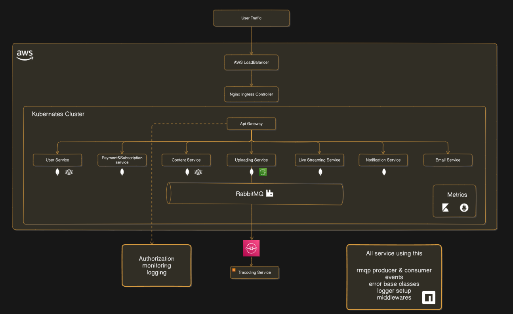
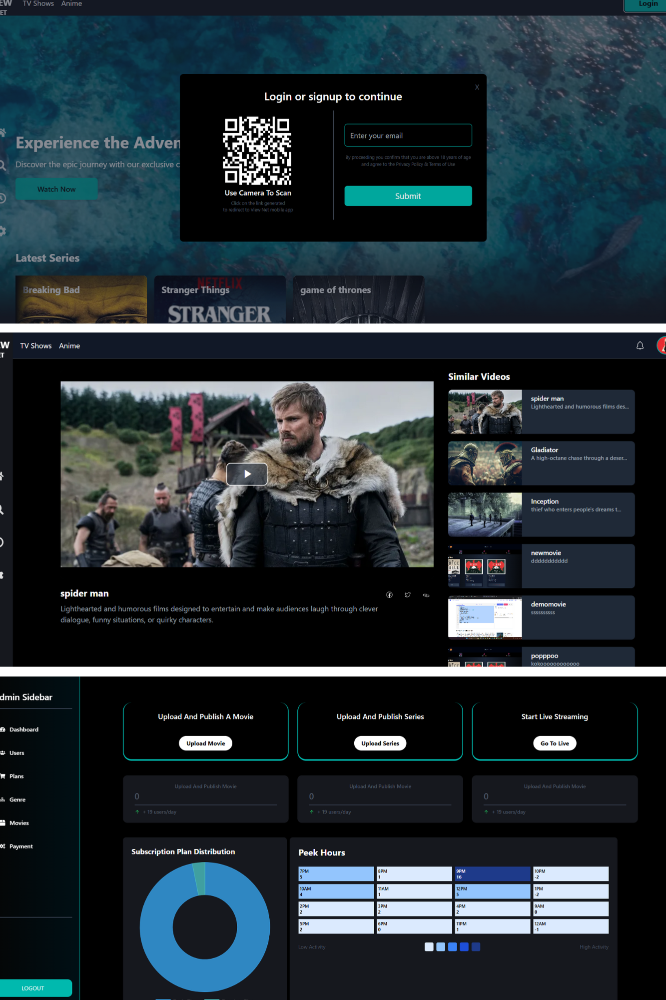

# viewnet - streaming application

### **Overview**
ViewNet is a full-stack streaming platform like Netflix, featuring on-demand video content and live streaming. It follows a microservices architecture with eight services (users, payment, content, uploading, transcoding, live streaming, notification, and email) and uses RabbitMQ for asynchronous messaging. The platform integrates Stripe API for subscriptions, employs FFmpeg & HLS for optimized video playback with CDN caching, and is containerized with Docker and orchestrated using Kubernetes. Built with Node.js, TypeScript, React, and MongoDB, it also leverages technologies like Socket.IO, MUX, AWS S3, CloudFront, and GitHub Actions for seamless deployment and performance. 


---
### **Architecture diagram**
 


## **Features**
1. **On-Demand & Live Streaming**:Watch pre-recorded videos or live streams seamlessly.
2. **Secure Payments**: Integrated Stripe API for subscription-based and one-time payments.
3. **Optimized Video Playback**: Uses FFmpeg & HLS with adaptive bitrate streaming and CDN caching.
4. **Real-Time Communication**:
   - Implements Socket.IO for instant updates and interactions.
   - Implements Live chating when live streams.
   - QR Code Login for passwordless login via QR code scanning.
5. **Notifications**:
   - Receive updates via in-app notifications.
   - Push notifications and efficient fan-out planned for future updates.

---

## **Technologies Used**

### **Client-Side**
<div>
  &nbsp;
  &nbsp;
  &nbsp;
  &nbsp;
   

</div>

### **Backend Services**
<div>
  &nbsp;
  &nbsp;
  &nbsp;
  &nbsp;
  &nbsp;
  &nbsp;
  &nbsp;
  &nbsp;

</div>

### **Infrastructure and Deployment**
<div>
  &nbsp;
  &nbsp;
  &nbsp;
  
</div>

---

## **Project Structure**
### **Services**
1. **Api Gateway**: Entry point of micorservices .
2. **user Service**: Handles user authentication and handles user additional data.
3. **Content Service**: Handles user watch movies/series and history tracking.
4. **Uploading Service**: Manages movies/series uploading.
5. **Payment Service**: Mange Payment and also listing webook from stripe.
6. **Live Streaming Service**: Manages and Start Live Streaming.
7. **Trascoding Service**: Resposible for HLS Support and covert into different resolution for ABS.
8. **Payment and Subscription Service**: Manages Subscription plans and Payments.
9. **Notification Service**: Sends updates via realtime in-app notifications.
10. **Email Service**: Send Otp to Email

---

## **Why I Build This Project?**
I built ViewNet to create a scalable streaming platform with microservices, FFmpeg, HLS, Stripe, QR login, and Kubernetes, enhancing performance and real-time communication. 

This app addresses these issues by offering:
1. **Scalable Streaming**: Ensuring smooth video playback with FFmpeg, HLS, and CDN caching.
2. **Secure Authentication**: Enabling QR code login for quick and passwordless access.
3. **Seamless Payments**: Integrating Stripe for hassle-free subscriptions and transactions.

 The Platform offering a vast library of movies, TV series, and exclusive Live Streaming.

---

## **Key Features to Expand**
- Push notifications for real-time updates.
- Efficient fan-out mechanisms for large-scale notifications.
- Enhanced admin dashboards for movie intrests and anlytics.
- Movie Recommandation based on Machine learning 
---

## **Usage**
### **User Workflow**
1. **Log In/Create Profile**.
2. **Browse Movies/Series**: Select a movie to start watching.
3. **Add to watchlist**: Choose movies/series to watch later.
4. **Create Multiple Profile**: Based on age criteria user can create for kids or adulth section.

### **Admin Workflow**
1. **Log In as Admin**.
2. **Analytics**: Peak hours and Most selling Subscription Plan.
3. **Upload Movies/Series**: Create thumnail and upload vedio with Data.
4. **Subscirption Plan Management**: Create new Plan or update existing Plan.
5. **Start Live Streaming**: Start Live Streaming using OBS like software.

---

## **Screenshots**



---

## **Development Setup**

### 
```bash


# Install dependencies
npm install

# Run the development server
npm run dev